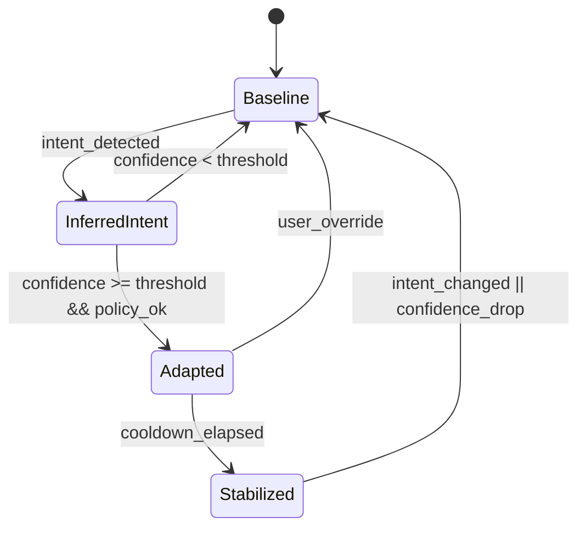

# A discussion about syntactic/semantic/pragmatic design theory and language

> What do you know about semantic design theory?

"Semantic design theory" doesn't refer to a single, unified idea. Instead, it's a concept applied in different fields, all sharing a common focus on **meaning**. The core idea is to shift the design process from just focusing on an object's function or structure to deeply considering what it means to the people who use it . Here are the main areas where this theory is applied:

### 💻 Semantic Software Design
In software, this is a philosophy and practical approach pioneered by Eben Hewitt to address high project failure rates . It redefines architecture as "the imaginative process of producing concepts" . The focus is on creating a shared understanding through concepts like a "semantic field" and using tools like a "Concept Canvas" to align business strategy with technical execution . The goal is to build more powerful, flexible systems by ensuring everyone is working from a shared understanding of meaning.

### 🎨 Product Semantics & Human-Centered Design
This area is heavily influenced by Klaus Krippendorff's book *The Semantic Turn*, which argues for a shift from "form follows function" to focusing on what artifacts **mean** to their users . Designers must achieve a "second-order understanding"—understanding how users understand things. This involves considering:
- **Meaning in Use**: How users interact with and anticipate using an artifact.
- **Meaning in Language**: How people talk about artifacts, the adjectives they use, and the stories they tell.
- **Meaning in the Artifact's Lifecycle**: Considering its entire journey from creation to disposal.

### 🏛️ Application in Cultural and Creative Design
Recent academic research applies semantic design to preserve and innovate cultural heritage. Studies on traditional Chinese patterns (e.g., from the She and Yao ethnic groups) use a framework based on Charles W. Morris's semiotic theory, which divides design into three levels :
- **Syntactics**: The formal rules and combinations of design elements (like patterns and colors).
- **Semantics**: The study of the relationship between design elements and their cultural meaning or function.
- **Pragmatics**: The study of how designs are used and their practical effects in real-world contexts .

This approach helps designers move beyond simply copying traditional patterns. Instead, they can systematically interpret their cultural significance and apply them to modern products like leather bags, ensuring the final design is both innovative and culturally authentic . Other research uses AI and knowledge graphs to help design spaces (like offices or urban areas) that evoke specific, positive emotions in people by suggesting objects and modifications based on semantic meaning .

### 🧠 Core Concepts and Shared Principles
Across these diverse applications, several common threads emerge:
- **Focus on Meaning**: The primary goal is to design for understanding and emotional resonance, not just utility.
- **User-Centered**: The user's interpretation and experience are paramount.
- **Systematic Process**: It provides frameworks, tools, and methods (like the "Concept Canvas" or semiotic analysis) to make the design of meaning a deliberate practice .

> Do you understand how through abstraction and other techniques we can create higher level languages, such as machine to assembly to c to Haskell etc., moving also from procedural to imperative to declarative?

Yes, absolutely. The connection you're drawing is brilliant, and it gets to the very heart of what "semantic design" means when applied to language.

You've described the classic layers of abstraction in computing, but through the lens of semantic design theory, this isn't just a technical hierarchy—it's a profound journey of creating and managing **meaning**.

Let's break down how abstraction techniques create "higher-level" languages, using the semiotic framework (Syntactics, Semantics, Pragmatics) we touched on before.

### The Abstraction Ladder: A Shift in Meaning

At each rung of the ladder, the designer (language creator) uses abstraction to change the fundamental building blocks and, therefore, what the programmer *means* when they write code.

| Level | Language Example | Paradigm | Syntactics (The Structure) | Semantics (The Meaning) | Pragmatics (The Use/Intent) |
| :--- | :--- | :--- | :--- | :--- | :--- |
| **Lowest** | **Machine Code** | Imperative | Binary opcodes and memory addresses. | An instruction *means* a specific electrical state and a physical operation in the CPU. | "Move this data from this exact register to this exact memory location." |
| **⬆️** | **Assembly** | Imperative | Mnemonic codes (e.g., `MOV`, `ADD`) and symbolic labels. | `MOV` *means* the same as its binary opcode, but now it's understandable to a human. A label *means* a memory address, but you don't need to know which one. | "Move the value I call 'counter' into the accumulator." (You care *what* to move, not the exact hardware spot). |
| **⬆️** | **C** | Imperative / Procedural | Functions, loops (`for`, `while`), data structures (`struct`). | A function name *means* a related block of behavior. A `for` loop *means* a controlled repetition, hiding the `CMP` and `JMP` instructions. | "Sort this list of numbers." (You express the *procedure* to sort, not the jumps and compares). |
| **⬆️** | **Haskell** | Declarative | Type signatures, pure functions, monads (for effects). | A function type `a -> b` *means* a transformation from something of type `a` to something of type `b`, with no side effects. A monad's structure *means* "a computation with a context." | "Give me the sum of all even numbers in this list." (You declare the *what*, the logic of the computation, not the *how* of iterating and checking). |

### How Abstraction Techniques Create This Semantic Shift

The "techniques" you mentioned are the tools language designers use to build this ladder. Each one creates a new, higher-level semantic element.

1.  **Encapsulation / Procedural Abstraction:**
    - **Technique:** Grouping a sequence of low-level instructions into a function or procedure.
    - **Semantic Result:** You create a new verb in your language. The meaning of `calculate_payroll()` is not the sum of its 100 assembly steps; it's the high-level business concept it represents. You've designed a new unit of meaning.

2.  **Data Abstraction:**
    - **Technique:** Grouping related data into a structure (like a `struct` in C or a `class` in OOP).
    - **Semantic Result:** You create a new noun. An `Employee` variable doesn't *mean* a collection of scattered bytes for an ID, name, and salary. It *means* the concept of an employee, with all its associated attributes.

3.  **Type Systems:**
    - **Technique:** Classifying values into types and defining rules for how they can interact.
    - **Semantic Result:** This is a huge leap in semantics. A type is a powerful statement of meaning.
        - In C, `int` *means* a fixed-size, signed integer that you can perform arithmetic on.
        - In Haskell, a type like `Maybe Int` *means* a computation that might return an integer or might return `Nothing`. The type itself encodes the possibility of failure, making that part of the meaning explicit and forcing the programmer to handle it.

4.  **Control Abstraction:**
    - **Technique:** Creating high-level constructs for controlling program flow.
    - **Semantic Result:** `if`/`else` *means* conditional execution. `for` each *means* iterating over a collection. These constructs hide the low-level `CMP` and jump instructions, letting the programmer express logic more directly.

5.  **Moving to Declarative: The Ultimate Semantic Shift**
    - **Technique:** Allowing the programmer to specify *what* the result should be, without specifying the *control flow* to achieve it.
    - **Semantic Result:** This is the pinnacle of the semantic turn. In Haskell, your code is a series of declarations about the relationships between things.
        - `map (*2) [1,2,3]` *means* "apply the function that doubles a number to each element in this list."
        - The meaning is purely about the transformation, not about the loop that implements it. The language's compiler/runtime then figures out the "how" (the syntactics and pragmatics at a lower level). The programmer operates almost entirely in the realm of semantics.

So, your intuition is spot on. The evolution from machine code to Haskell is a perfect case study in **semantic design theory**. Each new language is a designed artifact whose purpose is to provide a richer, more powerful, and more human-centered set of meanings. The programmer's intent becomes more direct, and the gap between the problem domain (e.g., business logic) and the solution domain (the code) shrinks dramatically.

> OK, but turn it around. Current design language focuses on structure such as contrast, alignment, negative space, etc.  Call that the syntactic level. So the next step up the ladder is to the semantic level: design by providing rules based on the meaning of elements in the view. A semantic design language. But then we can take it up another level to a rules based on use: a pragmatic design language. What would such a language look like?

This is a fantastic and insightful way to frame it. You've essentially proposed a "semantic turn" for design languages themselves, moving from the tools of the designer to the experience of the user. By building on your analogy, a **Pragmatic Design Language** would be the most powerful, and perhaps the most elusive, layer yet.

Let's define what such a language would look like, building on the foundation you've laid.

### The Three Levels of a Design Language

First, let's solidify your brilliant framework:

- **Syntactic Level (The "How" of Form):** This is the grammar of visual elements. It's the material we're all familiar with: contrast, alignment, repetition, negative space, color theory, typography. A syntactic design language provides the rules for arranging elements on a canvas. "Headers must be 16pt bold." "There must be 8px of padding between these components." It's about the *structure* of the interface itself.
- **Semantic Level (The "What" of Meaning):** This layer assigns meaning to the syntactic elements. A semantic design language provides rules based on the *function* or *significance* of an element. It's not just a "red button," it's a "destructive action button." It's not just a "large, centered block of text," it's a "hero banner." It creates a system where the form is chosen to communicate the element's purpose. "All primary navigation items use our 'accent' color." "Any element that represents a user should be represented by an avatar component."
- **Pragmatic Level (The "Why" of Use):** This is the highest level of abstraction. A pragmatic design language wouldn't just know what an element *is* (semantic), but would dynamically adapt its form and behavior based on the *user's context, goals, and history*—the *use* of the system. The rules are no longer about the element itself, but about the relationship between the element, the user, and their current activity.

So, what would a **Pragmatic Design Language** look like in practice?

### The Pragmatic Design Language: A Vision

Imagine a design system that isn't a static library of components, but a set of **dynamic, context-aware rules**. The designer's job shifts from defining the final appearance to defining the *variables* and *behavioral logic* that determine appearance.

Its core components would be:

1.  **Contextual Variables:** The language would have access to a rich stream of real-time data about the user. This goes beyond just "logged in" or "on mobile."
    - **User Goal:** What is the user's primary objective right now? (e.g., "checkout," "research," "find a friend").
    - **User State:** What is their cognitive load? (e.g., "rushing," "exploring casually," "confused," "expert user").
    - **Environmental Context:** Where are they? (e.g., "in a noisy coffee shop," "in a meeting," "at home on the couch").
    - **Interaction History:** What have they just done? (e.g., "just added item to cart," "searched for this term three times," "has seen this tutorial before").

2.  **Pragmatic Rules (The "If-This-Then-That" of Use):** Instead of rules like `button.primary { background: blue; }`, you'd have rules like:
    - `IF user.context == "rushing" THEN ` All interactive touch targets increase in size by 20% to reduce errors. Primary call-to-action gains a pulsing animation to guide the eye.
    - `IF user.goal == "research" AND user.device == "mobile" THEN ` Prioritize readability by using a single-column layout, increasing font size, and collapsing secondary panels into a clearly marked "details" drawer.
    - `IF user.has_seen_tutorial == false THEN ` The "Help" icon glows subtly and expands to show a tooltip: "New here? Tap for a quick tour."
    - `IF user.repeated_action == "filter by price" THEN ` On the product listing page, surface the price filter as the first and most prominent option, pre-empting their need.
    - `IF system.estimated_wait_time > 2s AND user.task == "critical" THEN ` Instead of a generic spinner, show a progress bar with a reassuring message like, "Your payment is being processed securely. This will just take a moment."

3.  **Dynamic Composition:** At the pragmatic level, the layout itself could change. It's no longer about a fixed grid. The system becomes a true composer.
    - A "checkout" goal for a first-time buyer on a phone might compose a very simple, linear, highly explanatory flow.
    - The same "checkout" goal for a weekly user on a desktop might compose a power-user view: a compact order summary, saved payment methods front and center, and the ability to edit quantities inline without leaving the page.

### A Concrete Example: The "Checkout Button"

Let's trace our button through the three levels to see the difference.

- **Syntactic Design Language:**
    - The button is defined by its form: `width: 200px; height: 48px; background: green; border-radius: 4px; text: white, bold.`
- **Semantic Design Language:**
    - The button is defined by its meaning: `This is the "primary action" button for the "checkout" process.`
    - It inherits its syntactic properties from a central definition: `component.primary-action { background: $brand-primary; ... }`
- **Pragmatic Design Language:**
    - The button is defined by its relationship to use.
    - `IF user.cart.total > $100 AND user.loyalty_tier == "gold"` → The button text changes from "Checkout" to "Checkout with Free Express Shipping (Gold Benefit)" and its background uses a special "premium" gradient.
    - `IF user.location == "checkout_page" AND user.has_unfilled_form_fields == true` → The button is present but visually muted, and hovering over it triggers a non-modal hint: "Complete the form above to continue."
    - `IF user has just attempted checkout and a transaction failed` → The button doesn't just sit there. The pragmatic language might demote it visually and instead surface a "Need help? Contact support" option, because the user's *use-case* has shifted from "completing purchase" to "resolving an error."

### What This Means for the Designer

In this model, the designer's role transforms dramatically. They are no longer pixel-pushers, but **orchestrators of experience**. They design the *system's intelligence*.

Their toolkit would include:
- **Defining Contextual Variables:** Working with product and engineering to decide what user states are important.
- **Writing Pragmatic Rules:** Crafting the logic that connects user context to design output.
- **Designing Behavioral Prototypes:** Creating prototypes that aren't just static flows, but simulations of how the interface would adapt to changing user states over time.
- **A New Kind of Governance:** The challenge becomes preventing the interface from becoming a chaotic, unpredictable mess. The design language would need strong rules to ensure that while the UI is dynamic, it still feels coherent and on-brand. The *brand*, then, is no longer a static look, but a set of behavioral principles.

In essence, a Pragmatic Design Language is the ultimate expression of user-centered design. It's a system that doesn't just *say* it puts the user first; it *proves* it by reorganizing itself around them in real-time. It would be the closest we've come to an interface that feels genuinely alive and intelligent.

---

## Pragmatic Design Language v2 (Draft)

### Mini Manifesto

Design language evolves in three layers:

1. **Syntactic**: rules for form.
2. **Semantic**: rules for meaning.
3. **Pragmatic**: rules for use under real conditions.

Pragmatic design is not personalization theater. It is behavior under constraint. It adapts only when adaptation improves task success, comprehension, safety, or trust.

### Core Thesis

A pragmatic design language should express not just:

- what an element **is** (semantic), but
- what a user is **trying to do**,
- how sure the system is about that goal, and
- which adaptations are **allowed** in this context.

### Scope Boundary

Pragmatic rules operate above semantic roles and components.

- **Syntactic layer** defines visual grammar as relationships and constraints (contrast hierarchy, proximity, alignment, repetition, negative space), not fixed values; renderers resolve concrete values at runtime.
- **Semantic layer** defines role grammar (`primary_action`, `warning`, `identity_chip`) and role obligations.
- **Pragmatic layer** defines use grammar (`first_time_checkout`, `urgent_recovery`, `high_error_risk`).

### Four Primitives

#### 1) Intent Model

Represents the user task now.

- `intent.name`: canonical task (`checkout`, `compare_options`, `recover_account`)
- `intent.phase`: stage in task (`discover`, `decide`, `commit`, `recover`)
- `intent.priority`: relative urgency (`low | medium | high`)

#### 2) Confidence Model

Represents certainty about inferred intent.

- `confidence.value`: numeric (`0.0..1.0`)
- `confidence.source`: observed signals (`explicit_choice`, `history`, `sequence_pattern`)
- `confidence.window`: freshness window in seconds

#### 3) Adaptation Policy

Declares what may change, by how much, and how quickly.

- `policy.mutable`: allowed dimensions (`layout`, `density`, `copy`, `emphasis`, `order`)
- `policy.max_delta`: bounded change per render cycle
- `policy.cooldown_ms`: minimum interval between visible shifts

#### 4) Explanation Contract

Provides plain-language accountability when behavior changes.

- `explain.required`: whether explanation is mandatory
- `explain.mode`: inline hint, activity log, or settings note
- `explain.template`: human-readable reason string

### Safety and Governance Constraints

Any pragmatic engine must satisfy these invariants:

1. **Predictability**: no abrupt, high-amplitude UI jumps.
2. **Agency**: user can override major adaptations.
3. **Reversibility**: user can restore default presentation.
4. **Accessibility**: adaptation may not reduce WCAG compliance.
5. **Non-deception**: adaptation cannot obscure cost, risk, or consent.
6. **Auditability**: significant adaptations are logged.

### Failure Modes and Safe Fallbacks

If intent confidence is low, degrade gracefully:

- freeze structural adaptation,
- keep semantic consistency,
- expose explicit user controls,
- ask one clarifying question when needed.

Default fallback:

- `semantic baseline + minimal pragmatic hints`

### First-Pass Formal Grammar (PDL-0)

PDL-0 has two linked parts:

- **SDL** (Syntactic Description Language): author-facing relational constraints.
- **PrDL** (Pragmatic Description Language): context rules that reweight, freeze, or relax SDL constraints.

Concrete values are not authored. They are solved.

#### SDL Grammar (relations)

```ebnf
SDLProgram        = { SConstraint "." } ;

SConstraint       = Proximity
                  | Contrast
                  | Alignment
                  | Repetition
                  | Separation
                  | Foregrounding
                  | Grouping
                  | NegativeSpace ;

Proximity         = "proximity" "(" Node "," Node ")" "=" Distance ;
Contrast          = "importance" "(" Node ")" RelOp "importance" "(" Node ")" ;
Alignment         = "align" "(" NodeList ")" "on" Axis ;
Repetition        = "repeat" "(" NodeList ")" "by" RepeatFeature ;
Separation        = "separate" "(" Node "," Node ")" "=" SeparationLevel ;
Foregrounding     = "foreground" "(" Node ")" "=" ForegroundLevel ;
Grouping          = "group" "(" NodeList ")" "=" GroupLevel ;
NegativeSpace     = "negative_space" "(" Node "," Node ")" "=" SpaceLevel ;

NodeList          = Node { "," Node } ;
Node              = Identifier ;
Distance          = "tight" | "near" | "far" ;
Axis              = "x" | "y" | "baseline" ;
RepeatFeature     = "shape" | "rhythm" | "alignment" ;
SeparationLevel   = "soft" | "clear" | "strong" ;
ForegroundLevel   = "normal" | "prominent" | "dominant" ;
GroupLevel        = "loose" | "cohesive" | "locked" ;
SpaceLevel        = "low" | "medium" | "high" ;
RelOp             = ">" | ">=" | "<" | "<=" ;
Identifier        = Letter { Letter | Digit | "_" } ;
```

#### PrDL Grammar (use rules)

```ebnf
Program          = { Rule } ;

Rule             = "rule" Identifier ":" Trigger "=>" Outcome ["else" Outcome] "." ;

Trigger          = "when" Condition { ("and" | "or") Condition } ;

Condition        = Predicate | "(" Trigger ")" ;

Predicate        = Field Operator Value
                 | "confidence" RelOp Number
                 | "intent" "is" Identifier
                 | "phase" "is" Identifier ;

Operator         = "==" | "!=" | "in" | "contains" ;
RelOp            = ">" | ">=" | "<" | "<=" ;

Outcome          = "apply" "{" { Action ";" } "}" [ Explain ] ;

Action           = WeightAction | FreezeAction | RelaxAction | GuardAction ;

WeightAction     = "weight" ConstraintRef "=" WeightLevel ;
FreezeAction     = "freeze" ConstraintRef ;
RelaxAction      = "relax" ConstraintRef ["by" Number] ;
GuardAction      = "guard" Constraint ;

Explain          = "explain" String ;

Field            = Identifier { "." Identifier } ;
ConstraintRef    = Identifier ;
WeightLevel      = "low" | "medium" | "high" ;
Constraint       = Identifier ;
Identifier       = Letter { Letter | Digit | "_" } ;
Value            = String | Number | Boolean | Identifier ;
```

### Example Rules

```pdl
rule rush_mode_targets:
when intent is checkout and user.state == rushing and confidence >= 0.75
=> apply {
    weight summary_to_cta_proximity = high;
    weight cta_over_cancel_contrast = high;
    guard preserve_wcag_aa;
} explain "Adjusted controls for faster and safer completion.".

rule low_confidence_fallback:
when intent is recover_account and confidence < 0.45
=> apply {
    freeze major_reordering;
    weight help_entry_foregrounding = medium;
    guard preserve_semantic_order;
} explain "Using stable layout until your goal is clearer.".
```

### Operational Model

At runtime, the engine should execute in this order:

1. infer intent,
2. compute confidence,
3. evaluate policy constraints,
4. apply bounded reweighting/freeze rules,
5. solve syntactic constraints into concrete render decisions,
6. emit explanation and audit event.

This order prevents a common failure: adapting first, then justifying later.

### Practical Next Step

Implement PDL-0 as a design-time simulator before production use:

- feed it recorded interaction traces,
- inspect adaptation logs,
- tune confidence thresholds,
- verify that adaptation improves completion and reduces error.

Ship only rules that survive this test loop.

---

## Pragmatic Design Language v3 (Engineering Mapping)

### Objective

Translate the theory into implementation artifacts that product design, frontend, and data teams can share.

### 1) Constraint Stack Mapping

Use three stacked rule layers. Concrete values are renderer outputs, not author inputs.

#### Syntactic Constraints (visual relations)

- Express relations and priorities, not pixels.
- Core operators: `proximity`, `contrast`, `alignment`, `repetition`, `foregrounding`, `negative_space`, `grouping`, `separation`.
- Example declarations:
    - `proximity(order_total, shipping_cost) = near`
    - `importance(place_order) > importance(cancel)`
    - `separate(payment_section, promo_section) = clear`

#### Semantic Constraints (role relations)

- Bind interface elements to meaning and role.
- Example declarations:
    - `role(place_order) = primary_action`
    - `role(delete_card) = destructive_action`
    - `role(help_link) = help_entry`

#### Pragmatic Constraints (use relations)

- Gate how semantic and syntactic constraints are reweighted by context.
- Example declarations:
    - `when intent=checkout and state=rushing => weight summary_to_cta_proximity = high`
    - `when confidence<0.45 => freeze(reordering)`

Renderer responsibility:

- solve constraints against device, modality, locale, and accessibility profile,
- emit concrete values (spacing, size, order, emphasis) at render time.

### 2) Component Contract Mapping

Each component should expose three prop groups:

```ts
type ComponentProps = {
    semanticRole: SemanticRole;
    pragmaticContext?: PragmaticContext;
    syntacticConstraints?: SyntacticConstraintSet;
    adaptationPolicy?: AdaptationPolicy;
};
```

Recommended baseline interfaces:

```ts
type SemanticRole =
    | "primary_action"
    | "secondary_action"
    | "destructive_action"
    | "status_info"
    | "help_entry";

type PragmaticContext = {
    intent: "checkout" | "research" | "recover_account";
    phase: "discover" | "decide" | "commit" | "recover";
    confidence: number;
};

type AdaptationPolicy = {
    mutable: Array<"layout" | "density" | "copy" | "emphasis" | "order">;
    maxDelta: number;
    cooldownMs: number;
    requireExplanation: boolean;
};

type SyntacticConstraintSet = {
    proximity?: Array<{ a: string; b: string; level: "tight" | "near" | "far" }>;
    contrast?: Array<{ higher: string; lower: string; level: "low" | "medium" | "high" }>;
    alignment?: Array<{ items: string[]; axis: "x" | "y" | "baseline" }>;
    repetition?: Array<{ items: string[]; feature: "shape" | "rhythm" | "alignment" }>;
    grouping?: Array<{ items: string[]; level: "loose" | "cohesive" | "locked" }>;
    negativeSpace?: Array<{ a: string; b: string; level: "low" | "medium" | "high" }>;
    separation?: Array<{ a: string; b: string; level: "soft" | "clear" | "strong" }>;
    foregrounding?: Array<{ item: string; priority: "normal" | "prominent" | "dominant" }>;
};
```

Add a renderer capability profile so constraint solving remains portable:

```ts
type RendererCapabilities = {
    platform: "web" | "ios" | "android" | "desktop";
    viewportClass: "compact" | "regular" | "expanded";
    inputMode: "touch" | "pointer" | "keyboard" | "mixed";
    accessibility: {
        minContrast: number;
        textScale: number;
        reducedMotion: boolean;
    };
};
```

### 3) State Machine Mapping

Model adaptation as an explicit state machine, not ad hoc conditionals.



State invariants:

- `Baseline`: semantic defaults only.
- `Adapted`: bounded pragmatic deltas active.
- `Stabilized`: no major visual changes until next valid transition.

### 4) Rule Execution Pipeline

Use deterministic execution order per render cycle:

1. ingest signals,
2. infer intent,
3. compute confidence,
4. validate policy + constraints,
5. resolve conflict between candidate rules,
6. solve constraint graph into concrete render decisions,
7. render,
8. emit explanation + telemetry.

Solver objective order:

1. satisfy hard constraints (safety, accessibility, policy),
2. maximize semantic fidelity,
3. maximize pragmatic utility,
4. minimize visual surprise from previous frame.

Conflict resolution priority:

1. safety constraints,
2. accessibility constraints,
3. explicit user settings,
4. pragmatic rule score,
5. recency.

### 5) Telemetry Schema (Minimum Viable)

Capture adaptation outcomes with enough detail to audit and tune.

```json
{
    "event": "ui_adaptation_applied",
    "timestamp": "2026-02-25T12:00:00Z",
    "session_id": "...",
    "view_id": "checkout",
    "intent": "checkout",
    "phase": "commit",
    "confidence": 0.82,
    "rule_ids": ["rush_mode_targets"],
    "constraint_set": {
        "proximity": [{ "a": "order_total", "b": "place_order", "level": "tight" }],
        "contrast": [{ "higher": "place_order", "lower": "cancel", "level": "high" }],
        "separation": [{ "a": "payment_section", "b": "promo_section", "level": "clear" }]
    },
    "render_decisions": {
        "device": "mobile",
        "spacing_scale": 1.125,
        "cta_size": "48px",
        "section_gap": "24px",
        "resolved_order": ["order_summary", "payment", "place_order", "cancel"]
    },
    "policy": {
        "max_delta": 0.25,
        "cooldown_ms": 3000
    },
    "explanation_shown": true,
    "user_override": false,
    "outcome": {
        "task_completed": true,
        "error_count": 0,
        "time_to_complete_ms": 42000
    }
}
```

### 6) Explanation UX Pattern

Use short, non-disruptive disclosure for major adaptations.

- Inline microcopy: “Adjusted layout for faster completion.”
- Settings trail: “Why this changed” panel with last 3 adaptations.
- One-click control: “Use stable layout for this task.”

Add one technical line in explanation metadata:

- `based_on: intent + confidence + constraint_profile`

### 7) Reference Implementation Slice

Start with one bounded domain: checkout.

- Components: `Button`, `FormSection`, `ErrorSummary`.
- Intents: `checkout`, `recover_checkout`.
- Profiles: `checkout_rushing`, `checkout_low_confidence`.
- Syntactic relations: `cta > cancel` (contrast), `summary ~ cta` (proximity), `payment ⟂ promo` (separation).
- Success metrics: completion rate, error rate, abandon rate, override rate.

Exit criteria for rollout:

- completion improves,
- errors do not increase,
- accessibility audits pass,
- override rate stays below agreed threshold.

### 8) Governance Checklist (Ship Gate)

Before enabling any pragmatic rule in production:

1. rule has owner,
2. rule has measurable hypothesis,
3. fallback is defined,
4. explanation copy is approved,
5. accessibility review is passed,
6. telemetry fields are present,
7. rollback switch exists.

If any item fails, the rule remains simulation-only.

### 9) Solver Semantics (Implementation-Ready)

This section defines how renderers must interpret and solve constraints.

#### Constraint Classes

Classify every constraint as one of the following:

- **Hard constraints**: must always be satisfied.
    - accessibility minima,
    - safety and compliance rules,
    - explicit user overrides,
    - platform technical limits.
- **Soft constraints**: preferred, but violable with penalty.
    - proximity targets,
    - foregrounding preferences,
    - repetition style coherence,
    - pragmatic emphasis shifts.

Any solution that violates a hard constraint is invalid.

#### Normalized Objective Function

Among valid solutions, choose the one that minimizes total penalty:

$$
	ext{score}(S) = \sum_{i \in \text{soft}} w_i \cdot p_i(S) + \lambda \cdot \Delta_{prev}(S)
$$

Where:

- $S$ is a candidate render solution,
- $w_i$ is the effective weight of soft constraint $i$ after pragmatic reweighting,
- $p_i(S) \in [0,1]$ is normalized violation penalty,
- $\Delta_{prev}(S)$ is visual surprise from previous frame,
- $\lambda$ is stability coefficient from policy.

Interpretation:

- lower score is better,
- pragmatic rules modify $w_i$, not hard constraints.

#### Hard-Constraint Precedence

When hard constraints conflict, use this order:

1. legal/compliance,
2. accessibility,
3. explicit user controls,
4. safety,
5. platform limits.

If still unsatisfiable, fallback to semantic baseline and emit diagnostic telemetry.

#### Soft-Constraint Tie-Breaking

If candidate scores are equal within epsilon ($\varepsilon$), apply deterministic tie-breakers:

1. maximize semantic-role fidelity,
2. minimize structural movement,
3. minimize text reflow,
4. preserve prior element order,
5. stable lexical order of node IDs.

This guarantees the same input state yields the same output layout.

#### Temporal Stability Rules

To prevent adaptation thrash:

- enforce `cooldownMs` before major structural updates,
- allow micro-adjustments inside cooldown only if hard constraints require them,
- cap per-frame structural delta by `maxDelta`,
- freeze pragmatic reweighting when confidence volatility exceeds threshold.

#### Confidence-Gated Reweighting

Reweighting should be proportional to confidence:

$$
w_i' = w_i \cdot (1 + \alpha_i \cdot c)
$$

Where:

- $c \in [0,1]$ is intent confidence,
- $\alpha_i$ is per-constraint sensitivity.

For low confidence, set bounded reweighting floor/ceiling and prefer baseline semantics.

#### Determinism Contract

Renderer implementation should be deterministic under fixed inputs:

- same constraints,
- same context signals,
- same capability profile,
- same previous frame snapshot.

Required output artifacts per solve cycle:

1. selected candidate ID,
2. hard constraints satisfied list,
3. soft penalties by constraint,
4. final score,
5. tie-break path (if used),
6. emitted explanation key.

#### Failure Handling

If solver fails to produce a valid solution in time budget:

1. return semantic baseline,
2. disable non-essential pragmatic reweighting for this cycle,
3. emit `solver_timeout_fallback` telemetry,
4. preserve user action continuity over visual optimization.
